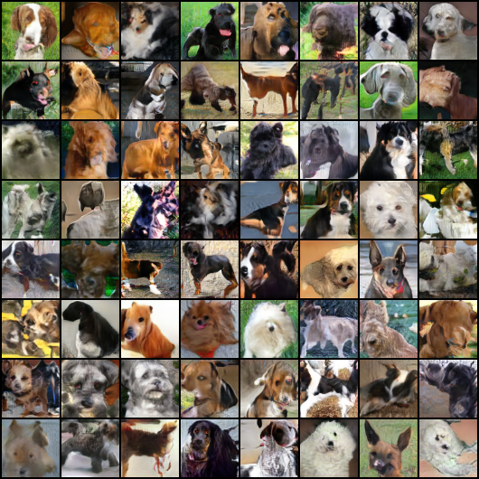

# kaggle-generative-dogs

- Codebase for 21st place solution for [Kaggle Generative Dog Images competition](https://www.kaggle.com/c/generative-dog-images/leaderboard). This was a kernels-only competition so my actual submission was a messy ipynb script, I cleaned it up a bit in this repo. The relevant files are in the `src` folder.

- I have used Conditional [Self-Attentive GANS](https://arxiv.org/abs/1805.08318) in this work. The top solutions for this competitions either used SA-GANS or [BigGANs](https://github.com/ajbrock/BigGAN-PyTorch). 

- This is also one of the first projects where I tried using [pytorch-ignite](https://pytorch.org/ignite/). I was tired of rewriting boilerplate model training code in Pytorch for every project. 

- To train the model, first grab the dataset from kaggle, place it in `input` folder and run `src/main.py`. The script runs for approximately 12 hours (this can be tuned by modifying the `CUTOFF_SECONDS` global variable in `src/main.py` 

- After 265 epochs, here are some generated images

---
#### Credits
- Kaggle Kernels
  - https://www.kaggle.com/phoenix9032/gan-dogs-starter-24-jul-custom-layers
  - https://www.kaggle.com/speedwagon/ralsgan-dogs
- Github Repos
  - https://github.com/shayneobrien/generative-models
  - https://github.com/ozanciga/gans-with-pytorch
  - https://github.com/voletiv/self-attention-GAN-pytorch
  - https://github.com/AlexiaJM/RelativisticGAN
